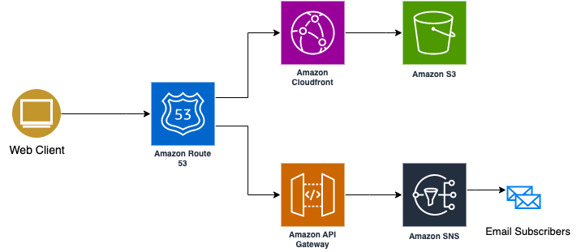
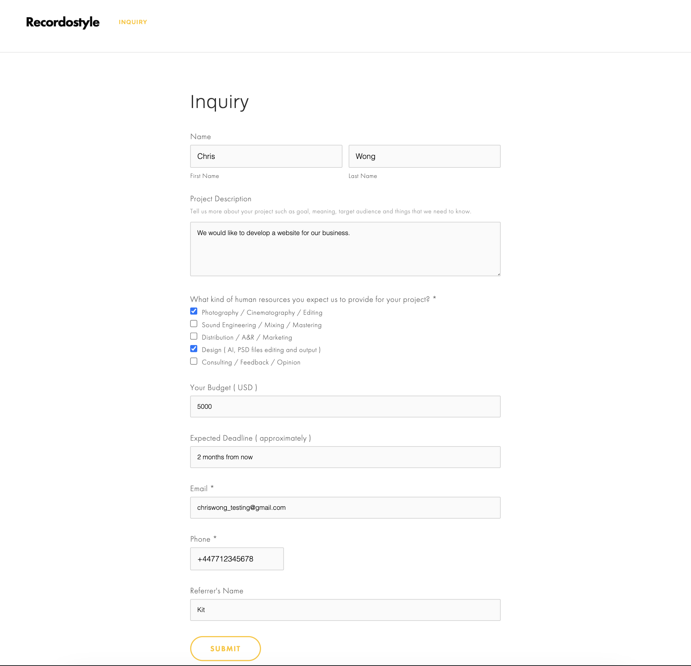
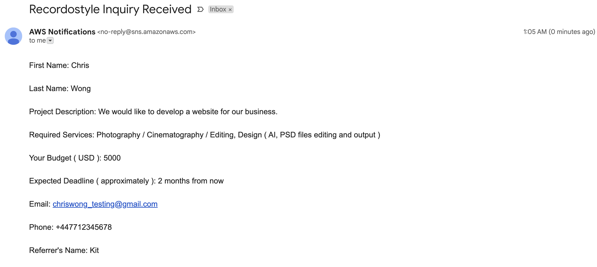

# Recordostyle
We are starting a production house, at this early stage a website with inquiry feature is needed. To make it simple the web hosting and inquiry email notification can be done by using AWS. This repos contains the resources provisioning for [https://recordostyle.com](https://recordostyle.com). The HTML and styling are stored in this repository [https://github.com/kitko112/recordostyle](https://github.com/kitko112/recordostyle).

## Infra

- S3 bucket (Store the website content of html, css, js ...etc )
- Cloudfront Distribution with OCA (Provide https for the website and CDN)
- Route 53 (Provide NS for the domain and routing, need point Godaddy to AWS NS)
- Certificate Manager (works only after NS updated)
- Api Gateway (integration point for the website) -> SNS (push notification to our email)

### Architecture Diagram


## Local test POST inquiry endpoint
```
curl -X POST https://api.recordostyle.com/v1/inquiry \
  --data "Hello, from your terminal!" \
  -H 'Content-Type: application/json'
```

## Quick Demo
1. A client submits an inquiry from the website.

2. My email account will receive a email sent by AWS Notification which shows the client's inquiry.
